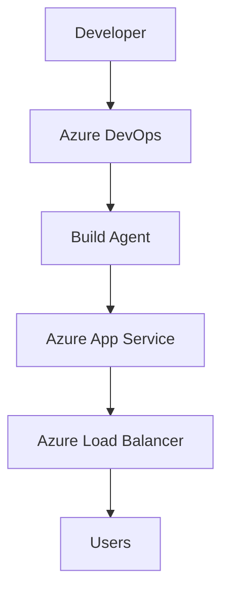
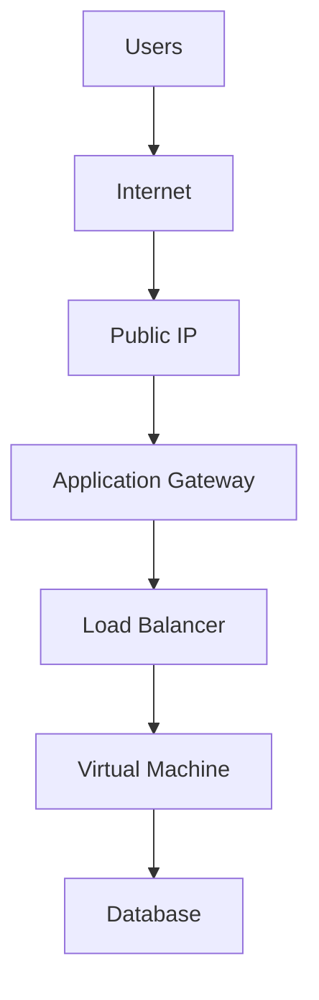

# Computer Networking Fundamentals for DevOps Engineers

Networking is one of the most important foundations for DevOps work. Every deployment, cloud service, pipeline agent, and user request depends on a working network.

<div
  style="display:grid;grid-template-columns:repeat(auto-fit,minmax(220px,1fr));gap:1rem;margin:1.2rem 0 1.5rem;"
  markdown="1"
>
  <article style="border:1px solid var(--md-default-fg-color--lightest);border-radius:8px;padding:1rem;background:linear-gradient(135deg,var(--md-default-bg-color),var(--md-code-bg-color));box-shadow:0 8px 22px rgba(0,0,0,.05);">
    <p style="margin:0 0 .4rem;font-size:.72rem;font-weight:700;letter-spacing:.08em;text-transform:uppercase;color:var(--md-primary-fg-color);">Core Skill</p>
    <h3 style="margin:0 0 .45rem;">Connectivity</h3>
    <p style="margin:0;">Understand how devices talk to each other.</p>
  </article>
  <article style="border:1px solid var(--md-default-fg-color--lightest);border-radius:8px;padding:1rem;background:linear-gradient(135deg,var(--md-default-bg-color),var(--md-code-bg-color));box-shadow:0 8px 22px rgba(0,0,0,.05);">
    <p style="margin:0 0 .4rem;font-size:.72rem;font-weight:700;letter-spacing:.08em;text-transform:uppercase;color:var(--md-primary-fg-color);">Cloud Skill</p>
    <h3 style="margin:0 0 .45rem;">Azure Networking</h3>
    <p style="margin:0;">Recognize VNets, gateways, load balancers, DNS, and security rules.</p>
  </article>
  <article style="border:1px solid var(--md-default-fg-color--lightest);border-radius:8px;padding:1rem;background:linear-gradient(135deg,var(--md-default-bg-color),var(--md-code-bg-color));box-shadow:0 8px 22px rgba(0,0,0,.05);">
    <p style="margin:0 0 .4rem;font-size:.72rem;font-weight:700;letter-spacing:.08em;text-transform:uppercase;color:var(--md-primary-fg-color);">DevOps Skill</p>
    <h3 style="margin:0 0 .45rem;">Troubleshooting</h3>
    <p style="margin:0;">Use simple tools to find DNS, port, route, and firewall problems.</p>
  </article>
</div>

[Start the lab](#hands-on-lab){ .md-button .md-button--primary }
[Command examples](#command-examples){ .md-button }
[Quiz](#quiz){ .md-button }

## Learning Objectives

By the end of today's lesson, you will be able to:

- Understand how computer networks work.
- Explain the **OSI** and **TCP/IP** models.
- Differentiate between IP addresses, subnet masks, and gateways.
- Understand DNS, HTTP, HTTPS, SSH, and FTP.
- Learn how Azure networking relies on these concepts.
- Use networking tools to troubleshoot connectivity.
- Understand networking terminology used in DevOps interviews.

## Why This Topic Matters

Nearly every Azure DevOps task involves networking:

- Azure Virtual Machines
- Azure Kubernetes Service (AKS)
- Azure Load Balancer
- Azure Application Gateway
- Azure Virtual Networks (VNets)
- VPN Gateways
- Azure DevOps self-hosted agents
- CI/CD deployments

Without networking knowledge, troubleshooting deployment failures, DNS issues, or connectivity problems becomes very difficult.

## What is a Computer Network?

A computer network is a collection of devices connected together to exchange data.

Examples:

- Home Wi-Fi
- Office LAN
- Azure Virtual Network (VNet)
- The Internet

## Types of Networks

| Type | Description               | Example               |
| ---- | ------------------------- | --------------------- |
| PAN  | Personal Area Network     | Bluetooth devices     |
| LAN  | Local Area Network        | Office network        |
| MAN  | Metropolitan Area Network | City-wide ISP network |
| WAN  | Wide Area Network         | Internet              |

## OSI Model

The OSI model explains networking in seven layers.

```text
+---------------------------+
| 7. Application            |
| 6. Presentation           |
| 5. Session                |
| 4. Transport              |
| 3. Network                |
| 2. Data Link              |
| 1. Physical               |
+---------------------------+
```

### Layer Responsibilities

| Layer        | Function                   |
| ------------ | -------------------------- |
| Application  | User-facing applications   |
| Presentation | Encryption and compression |
| Session      | Connection management      |
| Transport    | TCP and UDP                |
| Network      | Routing and IP addresses   |
| Data Link    | MAC addresses              |
| Physical     | Cables and signals         |

## TCP/IP Model

The TCP/IP model is simpler and is commonly used in real networks.

```text
Application
Transport
Internet
Network Access
```

Azure networking primarily follows the TCP/IP model.

## IP Address

An IP address identifies a device on a network.

Example:

```text
192.168.1.10
```

IPv4 consists of four octets, which together use 32 bits.

Example private ranges:

```text
10.0.0.0/8
172.16.0.0/12
192.168.0.0/16
```

Azure Virtual Networks commonly use these private ranges.

## Public vs Private IP

| Type       | Meaning                                  | Example    |
| ---------- | ---------------------------------------- | ---------- |
| Public IP  | Accessible over the Internet             | `52.x.x.x` |
| Private IP | Accessible only inside internal networks | `10.0.0.4` |

## DNS

Instead of remembering this IP address:

```text
20.55.120.11
```

We can use this name:

```text
portal.azure.com
```

DNS converts names into IP addresses.

## Important Ports

| Protocol | Port |
| -------- | ---- |
| HTTP     | 80   |
| HTTPS    | 443  |
| SSH      | 22   |
| FTP      | 21   |
| RDP      | 3389 |
| DNS      | 53   |

## HTTP vs HTTPS

HTTP sends web traffic without encryption.

```text
Browser
   |
   v
Server
```

HTTPS adds TLS encryption between the browser and the server.

```text
Browser
   |
   v
TLS Encryption
   |
   v
Server
```

Always prefer HTTPS for production environments.

## Enterprise Example

A developer pushes code to Azure Repos.



Each communication depends on reliable networking, DNS resolution, and secure protocols.

## Architecture Explanation



This layered architecture provides scalability and security.

## Hands-on Lab

### Objective

Explore your local network and recognize basic network settings.

=== "Windows"

    ```powershell title="Display IP configuration"
    ipconfig
    ```

    ```powershell title="Show detailed configuration"
    ipconfig /all
    ```

    ```powershell title="Test connectivity"
    ping google.com
    ```

    ```powershell title="Trace route"
    tracert google.com
    ```

    ```powershell title="Resolve DNS"
    nslookup portal.azure.com
    ```

=== "Linux/macOS"

    ```bash title="Display IP configuration"
    ip addr
    ```

    ```bash title="Test connectivity"
    ping google.com
    ```

    ```bash title="Trace route"
    traceroute google.com
    ```

    ```bash title="Resolve DNS"
    dig portal.azure.com
    ```

## Azure Portal Walkthrough

Navigate through these Azure services. Observe the available services and their relationships without creating resources yet.

- Virtual Networks
- Network Security Groups
- Public IP Addresses
- Load Balancers
- Application Gateway
- DNS Zones
- Network Watcher

## Command Examples

### Azure CLI Examples

```bash title="List available Azure regions"
az account list-locations --output table
```

```bash title="List resource groups"
az group list --output table
```

```bash title="List virtual networks"
az network vnet list --output table
```

```bash title="List public IPs"
az network public-ip list --output table
```

### PowerShell Examples

```powershell title="Log in"
Connect-AzAccount
```

```powershell title="List Azure locations"
Get-AzLocation
```

```powershell title="List resource groups"
Get-AzResourceGroup
```

```powershell title="List virtual networks"
Get-AzVirtualNetwork
```

### Git Commands

```bash title="Initialize a repository"
git init
```

```bash title="Check status"
git status
```

```bash title="Add files"
git add .
```

```bash title="Commit notes"
git commit -m "Day 2 Networking Notes"
```

### YAML Example

A simple Azure Pipeline trigger:

```yaml title="azure-pipelines.yml"
trigger:
  branches:
    include:
      - main

pool:
  vmImage: ubuntu-latest

steps:
  - script: echo "Networking Fundamentals"
```

### Terraform Example

Create a resource group:

```hcl title="main.tf"
resource "azurerm_resource_group" "rg" {
  name     = "rg-networking-demo"
  location = "East US"
}
```

Today, focus on understanding the syntax rather than applying it.

### Docker Example

```bash title="Display Docker information"
docker info
```

```bash title="List containers"
docker ps -a
```

These commands help verify that Docker is installed and functioning.

### Kubernetes Example

```bash title="View client version"
kubectl version --client
```

```bash title="Display current configuration"
kubectl config view
```

## Best Practices

- Use private IP addresses for internal services.
- Minimize exposure of public IPs.
- Restrict open ports.
- Prefer HTTPS over HTTP.
- Document network topology.
- Understand DNS before working with cloud networking.

## Common Mistakes

- Opening unnecessary firewall ports.
- Confusing public and private IP addresses.
- Ignoring DNS issues during troubleshooting.
- Misconfiguring subnet ranges.
- Overlapping IP ranges in virtual networks.

## Troubleshooting Scenario

### Problem

Your Azure VM cannot reach the Internet.

### Possible Causes

- Incorrect route table.
- Network Security Group (NSG) blocking outbound traffic.
- Missing public IP, if required.
- DNS misconfiguration.
- Firewall restrictions.

### Investigation Steps

1. Verify NSG rules.
2. Check effective routes.
3. Validate DNS settings.
4. Test connectivity with `ping` or `Test-NetConnection`.
5. Use Azure Network Watcher for diagnostics.

## Security Recommendations

- Allow only required ports.
- Use SSH instead of Telnet.
- Restrict RDP access to trusted IPs.
- Enable Network Security Groups.
- Use Just-In-Time (JIT) VM access where appropriate.
- Encrypt traffic using HTTPS and TLS.

## Performance Tips

- Reduce network latency by deploying resources in the same Azure region.
- Use Azure Load Balancer for high availability.
- Optimize DNS resolution.
- Avoid unnecessary network hops.
- Monitor bandwidth usage.

## Cost Optimization Tips

- Avoid unused public IP addresses.
- Delete idle networking resources.
- Use appropriate load balancer SKUs.
- Consolidate resources where practical.
- Monitor network egress charges.

## Enterprise Implementation

A production deployment typically includes:

- Azure Virtual Network (VNet)
- Separate subnets for web, application, and database tiers
- Network Security Groups
- Azure Application Gateway with Web Application Firewall (WAF)
- Azure Load Balancer
- Azure Bastion for secure administration
- Private endpoints for platform services
- Azure DNS for name resolution

## Mini Assignment

Run:

- `ipconfig` on Windows or `ip addr` on Linux
- `ping google.com`
- `nslookup portal.azure.com`

Identify:

- Your IPv4 address
- Default gateway
- DNS server

Create a one-page summary of:

- OSI Model
- TCP/IP Model
- Common ports

Commit your notes to your Git repository.

## Quiz

1. What is the purpose of the OSI model?
2. Which OSI layer is responsible for routing?
3. What is the difference between TCP and UDP?
4. What is DNS?
5. What is the default HTTPS port?
6. What is the difference between a public and private IP address?
7. What is a subnet?
8. What is the role of a default gateway?
9. Why is HTTPS preferred over HTTP?
10. Name three Azure networking services.

## Expected Outcome

After completing this lesson, you should be able to:

- Explain networking fundamentals and the OSI/TCP-IP models.
- Identify IP addresses, gateways, DNS servers, and common ports.
- Use basic networking diagnostic tools.
- Understand how Azure networking supports cloud infrastructure.
- Read simple network diagrams and relate them to Azure services.

## Revision Notes

- Networking is a foundational skill for every DevOps engineer.
- Understand the OSI and TCP/IP models conceptually rather than memorizing them.
- Learn the purpose of common ports such as 22, 53, 80, 443, and 3389.
- DNS is one of the most common causes of application connectivity issues.
- Azure Virtual Networks, NSGs, Load Balancers, and Application Gateways all build on these core networking concepts.
