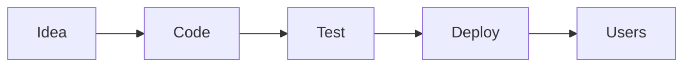
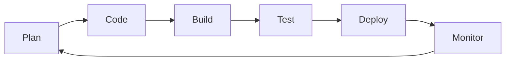

# Azure DevOps 365: Day 1

## What is DevOps?

DevOps combines:

```text
Development + Operations
```

Its goal is to:

- Deliver software faster
- Improve quality
- Reduce failures
- Automate repetitive tasks
- Increase collaboration

<div
  style="display:grid;grid-template-columns:repeat(auto-fit,minmax(220px,1fr));gap:1rem;margin:1.2rem 0 1.5rem;"
  markdown="1"
>
  <article style="border:1px solid var(--md-default-fg-color--lightest);border-radius:8px;padding:1rem;background:linear-gradient(135deg,var(--md-default-bg-color),var(--md-code-bg-color));box-shadow:0 8px 22px rgba(0,0,0,.05);">
    <p style="margin:0 0 .4rem;font-size:.72rem;font-weight:700;letter-spacing:.08em;text-transform:uppercase;color:var(--md-primary-fg-color);">People</p>
    <h3 style="margin:0 0 .45rem;">Work Together</h3>
    <p style="margin:0;">Developers, testers, and operations teams share the same goal.</p>
  </article>
  <article style="border:1px solid var(--md-default-fg-color--lightest);border-radius:8px;padding:1rem;background:linear-gradient(135deg,var(--md-default-bg-color),var(--md-code-bg-color));box-shadow:0 8px 22px rgba(0,0,0,.05);">
    <p style="margin:0 0 .4rem;font-size:.72rem;font-weight:700;letter-spacing:.08em;text-transform:uppercase;color:var(--md-primary-fg-color);">Process</p>
    <h3 style="margin:0 0 .45rem;">Automate Work</h3>
    <p style="margin:0;">Builds, tests, and deployments run with fewer manual steps.</p>
  </article>
  <article style="border:1px solid var(--md-default-fg-color--lightest);border-radius:8px;padding:1rem;background:linear-gradient(135deg,var(--md-default-bg-color),var(--md-code-bg-color));box-shadow:0 8px 22px rgba(0,0,0,.05);">
    <p style="margin:0 0 .4rem;font-size:.72rem;font-weight:700;letter-spacing:.08em;text-transform:uppercase;color:var(--md-primary-fg-color);">Result</p>
    <h3 style="margin:0 0 .45rem;">Release Safely</h3>
    <p style="margin:0;">Small changes reach users faster and are easier to fix.</p>
  </article>
</div>

[Start the lab](#hands-on-lab){ .md-button .md-button--primary }
[Check commands](#command-checklist){ .md-button }

!!! note "Day 1 focus"

    Learn the basic idea first. Tools like Kubernetes, Terraform, and pipeline YAML come later.

## Traditional Software Development

Before DevOps, many teams worked step by step like this:

```text
Requirements
  ↓
Development
  ↓
Testing
  ↓
Deployment
  ↓
Maintenance
```

Problems:

- Slow releases
- Manual deployments
- High failure rates
- Lack of automation
- Team silos

## Why DevOps Matters

Without DevOps, software teams often wait on each other. A change may move slowly from idea, to code, to test, to deployment.



DevOps makes this flow smoother by using teamwork, automation, testing, and monitoring.

| Old way         | DevOps way             |
| --------------- | ---------------------- |
| Big releases    | Small releases         |
| Manual steps    | Automated steps        |
| Testing late    | Testing often          |
| Teams separated | Teams working together |

## DevOps Lifecycle

Think of DevOps as a loop. Teams plan, build, check, release, and learn from real usage.



| Stage   | Simple meaning                  |
| ------- | ------------------------------- |
| Plan    | Decide what to make.            |
| Code    | Write the change.               |
| Build   | Prepare the app to run.         |
| Test    | Check if it works.              |
| Deploy  | Put it where users can use it.  |
| Monitor | Watch for problems and improve. |

???+ info "Simple words"

    **CI** means code is checked often.

    **CD** means the app is kept ready to release.

    **Automation** means the computer does repeatable work for you.

## Cloud Basics

Cloud means using computers, storage, databases, and tools through the internet.

You do not need to buy servers for every practice project. You can create cloud resources when needed and remove them when finished.

| Term | Simple meaning                                             |
| ---- | ---------------------------------------------------------- |
| IaaS | You manage a cloud server.                                 |
| PaaS | You deploy an app, and Azure manages much of the platform. |
| SaaS | You use ready-made software in a browser.                  |

!!! tip "Why cloud helps DevOps"

    Cloud resources can be created with commands, scripts, and pipelines. This makes practice and automation easier.

## Azure DevOps Services

Azure DevOps is a Microsoft platform for managing software work from idea to release.

| Service    | What it does                       |
| ---------- | ---------------------------------- |
| Boards     | Tracks work items.                 |
| Repos      | Stores code.                       |
| Pipelines  | Builds, tests, and deploys code.   |
| Test Plans | Helps with testing.                |
| Artifacts  | Stores packages and build outputs. |

## Azure Ecosystem Overview

Azure is Microsoft's cloud platform. On Day 1, only recognize these names.

<div
  style="display:grid;grid-template-columns:repeat(auto-fit,minmax(180px,1fr));gap:.8rem;margin:1rem 0;"
  markdown="1"
>
  <article style="border-left:4px solid var(--md-primary-fg-color);padding:.75rem .9rem;background:var(--md-code-bg-color);border-radius:8px;">
    <strong>App Service</strong><br>
    Hosts web apps and APIs.
  </article>
  <article style="border-left:4px solid var(--md-primary-fg-color);padding:.75rem .9rem;background:var(--md-code-bg-color);border-radius:8px;">
    <strong>Storage</strong><br>
    Saves files and data.
  </article>
  <article style="border-left:4px solid var(--md-primary-fg-color);padding:.75rem .9rem;background:var(--md-code-bg-color);border-radius:8px;">
    <strong>Azure SQL</strong><br>
    Stores relational data.
  </article>
  <article style="border-left:4px solid var(--md-primary-fg-color);padding:.75rem .9rem;background:var(--md-code-bg-color);border-radius:8px;">
    <strong>Azure Monitor</strong><br>
    Watches apps and alerts you.
  </article>
  <article style="border-left:4px solid var(--md-primary-fg-color);padding:.75rem .9rem;background:var(--md-code-bg-color);border-radius:8px;">
    <strong>Key Vault</strong><br>
    Protects secrets.
  </article>
  <article style="border-left:4px solid var(--md-primary-fg-color);padding:.75rem .9rem;background:var(--md-code-bg-color);border-radius:8px;">
    <strong>Entra ID</strong><br>
    Manages identity and sign-in.
  </article>
</div>

## Hands-On Lab

Prepare a simple learning setup.

!!! success "Done when"

    You can open VS Code, run a few commands, and keep notes in a local folder.

### 1. Install the tools

| Tool      | Why it helps                                  |
| --------- | --------------------------------------------- |
| Git       | Saves code history.                           |
| VS Code   | Lets you edit files and use a terminal.       |
| Azure CLI | Lets you work with Azure using commands.      |
| Docker    | Helps you learn containers later.             |
| Terraform | Helps you learn infrastructure as code later. |
| kubectl   | Helps you learn Kubernetes later.             |

### 2. Create accounts

- Microsoft Azure
- Azure DevOps
- GitHub

### 3. Create a learning folder

```text
AzureDevOps365/
    Labs/
    Projects/
    Notes/
    Scripts/
```

=== "PowerShell"

    ```powershell title="Create folders"
    New-Item -ItemType Directory -Path AzureDevOps365, AzureDevOps365\Labs, AzureDevOps365\Projects, AzureDevOps365\Notes, AzureDevOps365\Scripts
    ```

=== "Bash"

    ```bash title="Create folders"
    mkdir -p AzureDevOps365/{Labs,Projects,Notes,Scripts}
    ```

## Command Checklist

Run these commands only to check that tools are installed.

=== "Git"

    ```bash title="Git"
    git --version
    git config --global user.name "Your Name"
    git config --global user.email "you@example.com"
    ```

=== "Azure CLI"

    ```bash title="Azure CLI"
    az version
    az login
    az account show --output table
    ```

=== "Docker"

    ```bash title="Docker"
    docker --version
    docker ps
    ```

=== "Terraform"

    ```bash title="Terraform"
    terraform version
    ```

=== "Kubernetes"

    ```bash title="kubectl"
    kubectl version --client
    ```

## First Examples

You do not need to master these today. Just notice how they look.

=== "Azure Pipeline"

    ```yaml title="azure-pipelines.yml"
    trigger:
      - main

    pool:
      vmImage: ubuntu-latest

    steps:
      - script: echo "Hello Azure DevOps"
    ```

=== "Terraform"

    ```hcl title="main.tf"
    terraform {
      required_version = ">= 1.0"
    }
    ```

## Azure Portal Walkthrough

Open the Azure portal and look around. Do not create paid resources yet.

1. Azure Home
2. Resource Groups
3. Storage Accounts
4. Azure Monitor
5. Microsoft Entra ID
6. Cost Management
