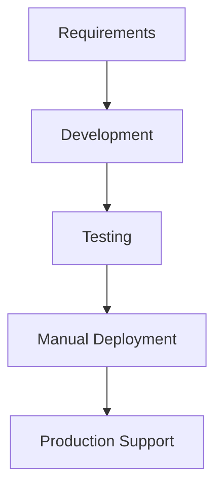
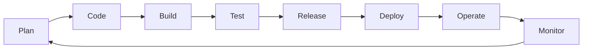
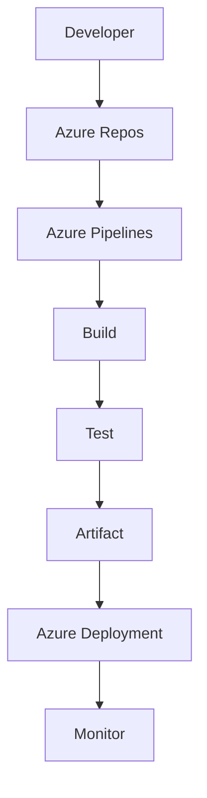
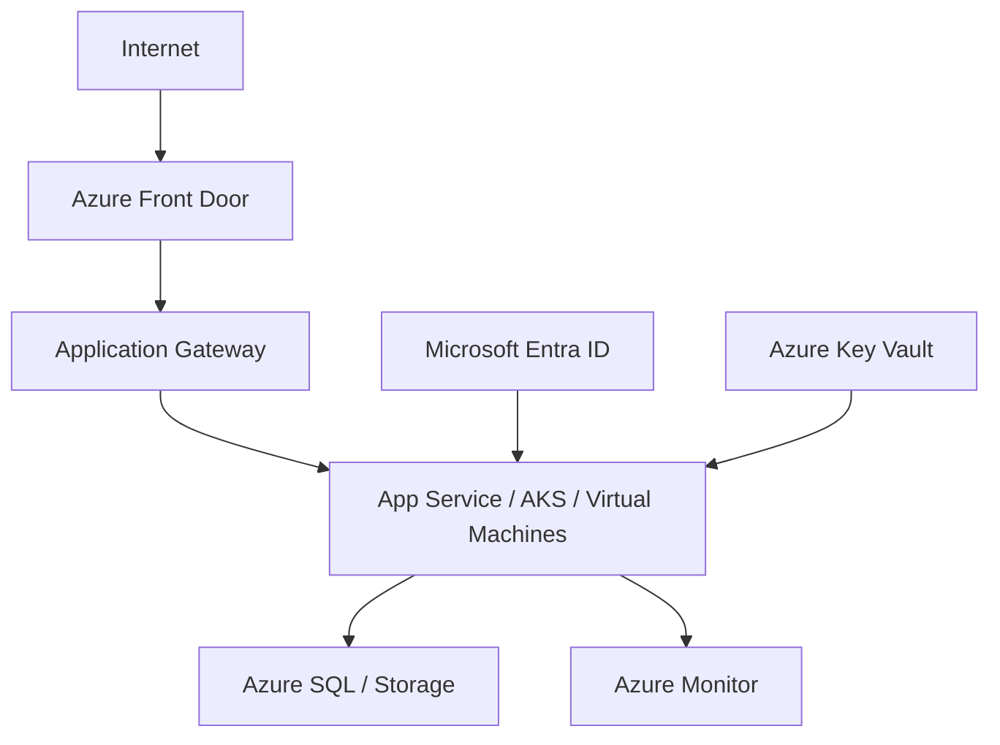

# Azure DevOps 365: Day 1

## Foundations

**Topic:** Introduction to DevOps, cloud computing, and the Azure ecosystem  
**Duration:** 2-3 hours  
**Level:** Beginner

[Start the lab](#hands-on-lab){ .md-button .md-button--primary }
[Command checklist](#command-checklist){ .md-button }
[Quiz](#quiz){ .md-button }

!!! note "Day 1 focus"

    Today is about understanding the purpose of DevOps and preparing your learning environment. Do not rush into Kubernetes, Terraform, or complex pipeline YAML yet.

## What You Will Learn

By the end of this lesson, you should be able to:

- Explain what DevOps is and why it exists.
- Describe the basic software delivery lifecycle.
- Understand cloud computing at a beginner level.
- Identify the main Azure DevOps services.
- Understand where Azure DevOps fits in the Azure ecosystem.
- Prepare your tools, accounts, and folder structure for future labs.

## Big Picture

<div class="grid cards" markdown>

- **DevOps**

  ***

  A culture and practice for delivering software faster, safer, and with better collaboration.

- **Cloud**

  ***

  On-demand computing resources delivered through APIs, portals, and automation tools.

- **Azure DevOps**

  ***

  Microsoft's platform for boards, Git repositories, CI/CD pipelines, testing, and artifacts.

- **Azure**

  ***

  Microsoft's cloud platform for hosting applications, data, identity, security, and monitoring.

</div>

## Why DevOps Exists

Traditional software delivery often had separate teams and slow handoffs:



Common problems:

- Releases were slow and risky.
- Deployments depended on manual steps.
- Testing and security happened late.
- Developers and operations teams worked in silos.
- Rollbacks were difficult.
- Production issues were discovered too late.

DevOps improves this by using collaboration, automation, continuous testing, and monitoring.

| Traditional delivery | DevOps delivery         |
| -------------------- | ----------------------- |
| Large releases       | Small frequent releases |
| Manual deployments   | Automated deployments   |
| Late testing         | Testing on every change |
| Team silos           | Shared ownership        |
| Reactive support     | Monitoring and alerts   |

!!! warning "Beginner mistake"

    DevOps is not just writing pipeline YAML. Pipelines are only one part of a larger delivery system.

## DevOps Lifecycle

The DevOps lifecycle is continuous:



| Stage   | Meaning                                                   |
| ------- | --------------------------------------------------------- |
| Plan    | Decide what to build and track work.                      |
| Code    | Write application, test, script, and infrastructure code. |
| Build   | Compile, package, and validate the application.           |
| Test    | Run automated quality, security, and integration checks.  |
| Release | Prepare an approved version for deployment.               |
| Deploy  | Move the change into an environment.                      |
| Operate | Keep the system healthy and available.                    |
| Monitor | Collect metrics, logs, traces, and alerts.                |

???+ info "CI, CD, and DevSecOps"

    **Continuous Integration (CI)** means code changes are merged often and automatically built and tested.

    **Continuous Delivery (CD)** means the application is always kept ready for release.

    **Continuous Deployment** means approved changes can be deployed automatically.

    **DevSecOps** means security checks are included throughout the lifecycle.

## Cloud Computing Basics

Cloud computing means using computing resources over the internet instead of buying and managing all hardware yourself.

Core benefits:

- **Elasticity:** scale resources up or down.
- **Pay-as-you-go:** pay for actual usage.
- **Managed services:** use databases, identity, monitoring, and compute without managing every server detail.
- **Global reach:** host workloads near users.
- **Automation:** create and manage resources through APIs and tools.

| Model | What you manage                    | Example                      |
| ----- | ---------------------------------- | ---------------------------- |
| IaaS  | Virtual machines, OS, runtime, app | Azure Virtual Machines       |
| PaaS  | Application and configuration      | Azure App Service, Azure SQL |
| SaaS  | Almost only usage and access       | Microsoft 365, Azure DevOps  |

!!! tip "DevOps view of cloud"

    Cloud resources can be created from scripts, CLI commands, Terraform, Bicep, SDKs, and pipelines. That is why cloud and DevOps are closely connected.

## Azure DevOps Services

Azure DevOps helps teams manage the full software delivery process.

| Service          | Purpose                                               |
| ---------------- | ----------------------------------------------------- |
| Azure Boards     | Track epics, features, user stories, bugs, and tasks. |
| Azure Repos      | Store source code in Git repositories.                |
| Azure Pipelines  | Build, test, package, and deploy applications.        |
| Azure Test Plans | Manage manual and exploratory testing.                |
| Azure Artifacts  | Store and share packages and build outputs.           |



## Azure Ecosystem Overview

A simple enterprise Azure application may use:



Important services to recognize on Day 1:

- **Microsoft Entra ID:** identity and access management.
- **Resource Groups:** containers for related Azure resources.
- **App Service:** managed hosting for web apps and APIs.
- **AKS:** managed Kubernetes for containers.
- **Virtual Machines:** cloud servers.
- **Storage:** object, file, queue, and table storage.
- **Azure SQL:** managed relational database.
- **Azure Monitor:** metrics, logs, alerts, and observability.
- **Key Vault:** secure storage for secrets, keys, and certificates.
- **Cost Management:** spending visibility, budgets, and alerts.

## Azure DevOps Engineer Role

An Azure DevOps Engineer helps teams deliver software reliably.

Typical responsibilities:

- Manage repositories and branching strategies.
- Build CI/CD pipelines.
- Automate infrastructure with Terraform or Bicep.
- Configure dev, test, staging, and production environments.
- Add testing, security scanning, and approval gates.
- Store secrets safely with Azure Key Vault.
- Configure monitoring, alerts, and dashboards.
- Improve release reliability and rollback plans.

## Hands-On Lab

### Objective

Prepare your Azure DevOps learning environment.

!!! success "Done when"

    You can open VS Code, run Git commands, check Azure CLI, verify Docker, and save your notes in a local folder.

### Step 1: Install tools

| Tool               | Why you need it                      |
| ------------------ | ------------------------------------ |
| Git                | Version control and GitHub practice. |
| Visual Studio Code | Editor and integrated terminal.      |
| Azure CLI          | Azure command-line management.       |
| PowerShell 7+      | Cross-platform automation.           |
| Docker Desktop     | Container practice.                  |
| Terraform          | Infrastructure as Code practice.     |
| kubectl            | Kubernetes command-line practice.    |

Useful VS Code extensions:

- Azure Account
- Azure Resources
- Azure CLI Tools
- Docker
- Kubernetes
- Terraform
- YAML
- GitHub Pull Requests

### Step 2: Create accounts

Create or verify access to:

- Microsoft Azure
- Azure DevOps
- GitHub

Enable MFA on Microsoft and GitHub accounts.

### Step 3: Create your learning folder

```text
AzureDevOps365/
    Labs/
    Projects/
    Notes/
    Scripts/
```

=== "PowerShell"

    ```powershell title="Create folders"
    New-Item -ItemType Directory -Path AzureDevOps365, AzureDevOps365\Labs, AzureDevOps365\Projects, AzureDevOps365\Notes, AzureDevOps365\Scripts
    ```

=== "Bash"

    ```bash title="Create folders"
    mkdir -p AzureDevOps365/{Labs,Projects,Notes,Scripts}
    ```

## Command Checklist

Run these commands to verify your setup.

=== "Azure CLI"

    ```bash title="Azure CLI"
    az version
    az login
    az account list --output table
    az account show --output table
    ```

=== "PowerShell"

    ```powershell title="PowerShell"
    $PSVersionTable
    Install-Module Az -Scope CurrentUser
    Connect-AzAccount
    Get-AzSubscription
    ```

=== "Git"

    ```bash title="Git"
    git --version
    git config --global user.name "Your Name"
    git config --global user.email "you@example.com"
    git config --list
    ```

=== "Docker"

    ```bash title="Docker"
    docker --version
    docker images
    docker ps
    ```

=== "Terraform"

    ```bash title="Terraform"
    terraform version
    ```

=== "Kubernetes"

    ```bash title="kubectl"
    kubectl version --client
    ```

## First Examples

You do not need to execute these today. Just recognize the syntax.

=== "Azure Pipeline"

    ```yaml title="azure-pipelines.yml"
    trigger:
      - main

    pool:
      vmImage: ubuntu-latest

    steps:
      - script: echo "Hello Azure DevOps"
    ```

=== "Terraform"

    ```hcl title="main.tf"
    terraform {
      required_version = ">= 1.0"
    }
    ```

## Azure Portal Walkthrough

Open the Azure portal and explore:

1. Azure Home
2. Resource Groups
3. Virtual Machines
4. Storage Accounts
5. Azure Monitor
6. Microsoft Entra ID
7. Cost Management

Do not create paid resources yet. Today is only for navigation and familiarity.

## Safety Notes

### Security

- Enable MFA.
- Never commit passwords, tokens, or connection strings.
- Use Azure Key Vault for real secrets.
- Use least privilege access.
- Keep tools updated.

### Cost

- Use Azure Free Tier where possible.
- Set budgets and spending alerts before creating resources.
- Delete lab resources when finished.
- Stop or deallocate virtual machines when idle.
- Use one resource group per lab for easy cleanup.

### Common mistakes

- Jumping into Kubernetes before understanding containers and networking.
- Memorizing commands without understanding them.
- Skipping Git basics.
- Not writing notes.
- Leaving cloud resources running.
- Using admin accounts for daily practice.

## Troubleshooting

**Problem:** `az login` fails.

Possible causes:

- Azure CLI is not installed correctly.
- Browser login cannot complete.
- Network, firewall, or proxy restrictions block authentication.
- The wrong account, tenant, or subscription is active.
- Azure CLI is outdated.

Try this flow:

```bash title="Azure CLI login checks"
az version
az login --use-device-code
az account list --output table
az account show --output table
```

If the wrong subscription is active:

```bash title="Set subscription"
az account set --subscription "<subscription-name-or-id>"
```

## Mini Assignment

Complete these tasks:

1. Install Git, VS Code, Azure CLI, PowerShell 7+, Docker, Terraform, and kubectl.
2. Sign in to Azure.
3. Create the `AzureDevOps365` folder structure.
4. Configure Git with your name and email.
5. Create `Notes/day-01-foundations.md`.
6. In your note, explain DevOps in your own words.
7. Capture the output of the setup commands from the command checklist.

## Quiz

1. What problem does DevOps solve?
2. What are the stages of the DevOps lifecycle?
3. What is Continuous Integration?
4. What is Continuous Delivery?
5. What is Azure DevOps?
6. What does Azure CLI do?
7. Why is Git important in DevOps?
8. What is Infrastructure as Code?
9. Why should secrets never be stored in source code?
10. What is Azure Monitor used for?

??? success "Answer guide"

    1. DevOps reduces slow handoffs, manual work, risky releases, and poor feedback.
    2. Plan, Code, Build, Test, Release, Deploy, Operate, Monitor.
    3. CI automatically builds and tests code when changes are integrated.
    4. Continuous Delivery keeps software ready to release after checks pass.
    5. Azure DevOps is Microsoft's platform for planning, repos, pipelines, tests, and artifacts.
    6. Azure CLI manages Azure resources from a terminal or automation script.
    7. Git provides history, collaboration, branching, review, and rollback.
    8. Infrastructure as Code stores infrastructure definitions in version-controlled files.
    9. Secrets in source code can leak credentials and compromise systems.
    10. Azure Monitor collects metrics, logs, alerts, and operational signals.

## Expected Outcome

After Day 1, you should be able to:

- Explain DevOps at a beginner level.
- Describe the software delivery lifecycle.
- Identify Azure DevOps services.
- Understand basic Azure cloud services.
- Verify your local tools.
- Start keeping organized notes for future labs.

## Revision Notes

- DevOps is culture plus automation.
- Azure DevOps supports planning, source control, CI/CD, testing, and packages.
- Cloud platforms are API-driven and automation-friendly.
- Security and cost awareness start on Day 1.
- Learn the why before the how.

## Week 1 Goal

Build a strong foundation in DevOps, cloud computing, Git, operating systems, networking basics, and tool setup. This foundation supports upcoming lessons on Azure, CI/CD, Docker, Kubernetes, Infrastructure as Code, monitoring, and secure delivery.
