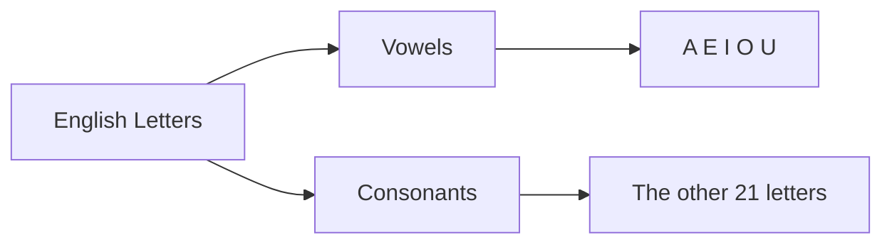

# English Foundations

English has 26 letters. They belong to two simple families: **vowels** and **consonants**.

!!! tip "Today's goal"

    	Do not try to master every sound today. First, learn the letter names, notice the two families, and understand why vowels are so important inside words.

## The 26 Letters

Each letter has a **name** and a common **sound** it makes in words.

| Letter | Letter's Name | Common Sound | Example Word       |
| ------ | ------------- | ------------ | ------------------ |
| A      | ay            | a, as in cat | **a**pple          |
| B      | bee           | b            | **b**all           |
| C      | see           | k / s        | **c**at / **c**ity |
| D      | dee           | d            | **d**og            |
| E      | ee            | e, as in bed | **e**gg            |
| F      | eff           | f            | **f**ish           |
| G      | jee           | g / j        | **g**o / **g**iant |
| H      | aitch         | h            | **h**at            |
| I      | eye           | i, as in sit | **i**n             |
| J      | jay           | j            | **j**am            |
| K      | kay           | k            | **k**ite           |
| L      | ell           | l            | **l**ion           |
| M      | em            | m            | **m**oon           |
| N      | en            | n            | **n**ose           |
| O      | oh            | o, as in hot | **o**range         |
| P      | pee           | p            | **p**en            |
| Q      | cue           | kw           | **q**ueen          |
| R      | ar            | r            | **r**ed            |
| S      | ess           | s            | **s**un            |
| T      | tee           | t            | **t**en            |
| U      | you           | u, as in cup | **u**mbrella       |
| V      | vee           | v            | **v**an            |
| W      | double-u      | w            | **w**ater          |
| X      | ex            | ks           | bo**x**            |
| Y      | why           | y / i        | **y**es            |
| Z      | zed / zee     | z            | **z**ebra          |

??? practice "Say the alphabet slowly"

    Read the table from A to Z. For each row, say the letter name first, then say the example word.

    Example: **A** -> ay -> apple

## The Two Letter Families

English letters belong to two main families.

=== "Vowels"

    **Vowels** are sounds that flow freely. Your mouth stays open, and your tongue, lips, and teeth do not block the air.

    Try saying **aaaaaaa**. You can hold it as long as you have breath. That is a vowel sound.

    The 5 main vowels are:

    **A, E, I, O, U**

    !!! note "What about Y?"

    	We will come back to **Y** later because it is flexible. It can sometimes behave like a vowel.

=== "Consonants"

    **Consonants** are the other 21 letters. When you say a consonant, something in your mouth blocks or shapes the air before releasing it.

    Try saying **b**. Your lips close and open quickly. You cannot hold it the same way you hold **aaaaaaa**. That is a consonant sound.

    !!! example "Quick check"

    	In **ball**, the letter **B** starts with a blocked sound. Your lips close before the sound comes out.

## Why This Matters

Many simple English words follow this pattern:

**Consonant + Vowel + Consonant**

| Word    | Pattern                             |
| ------- | ----------------------------------- |
| **cat** | C consonant + A vowel + T consonant |
| **bed** | B consonant + E vowel + D consonant |
| **sit** | S consonant + I vowel + T consonant |
| **dog** | D consonant + O vowel + G consonant |
| **cup** | C consonant + U vowel + P consonant |

!!! info "Simple idea"

    Consonants often frame the word. Vowels give the word its main sound.

## The 5 Vowels and Their Sounds

Each vowel can have a **short** sound and a **long** sound. You do not need to master them yet. For now, just notice that both sounds exist.

=== "Short sounds"

    | Vowel | Sound | Examples |
    | --- | --- | --- |
    | **A** | a, as in c**a**t | cat, hat, man |
    | **E** | e, as in b**e**d | bed, red, ten |
    | **I** | i, as in s**i**t | sit, him, big |
    | **O** | o, as in h**o**t | hot, dog, top |
    | **U** | u, as in c**u**p | cup, bus, run |

=== "Long sounds"

    | Vowel | Sound | Examples |
    | --- | --- | --- |
    | **A** | ay, as in c**a**ke | cake, name, late |
    | **E** | ee, as in s**ee** | he, me, these |
    | **I** | eye, as in k**i**te | kite, time, fine |
    | **O** | oh, as in h**o**me | home, note, stone |
    | **U** | you, as in r**u**le | rule, tune, cube |

??? success "Mini review"

    - English has **26 letters**.
    - The main vowels are **A, E, I, O, U**.
    - The other 21 letters are **consonants**.
    - Many simple words follow the pattern **consonant + vowel + consonant**.
