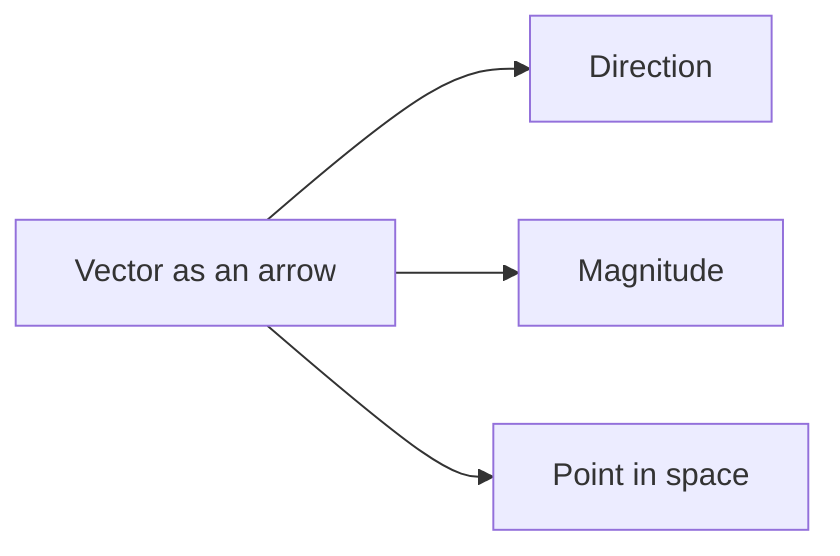

# Mathematics: Part 1 — Intuition

## Vectors and Why They Are Everywhere in AI

A vector is more than a list of numbers. It is a way to describe direction, magnitude, and position.

### 1. What is a vector?

Think of a vector as an arrow:

- It has a length, called its magnitude.
- It has a direction.
- It can also be seen as a point in space.

In machine learning, a vector often represents a row of features. For example, a sentence embedding might be a vector of 768 numbers.

### 2. Scalars, vectors, matrices, and tensors

- A scalar is one number.
- A vector is a 1D collection of numbers.
- A matrix is a 2D grid of numbers.
- A tensor is a higher-dimensional array.

This hierarchy matters because AI systems work with data at many levels:

- word embeddings are vectors
- datasets are matrices
- image batches and transformer activations are tensors

### 3. What does a high-dimensional vector mean?

When someone says an embedding has 1536 dimensions, they mean the vector has 1536 values. Each value captures one aspect of meaning or structure.

A 1536-dimensional embedding is not mysterious. It is simply a point in a very high-dimensional space.

### 4. Vector addition and scaling

Vectors can be added and scaled:

```python
import numpy as np

v1 = np.array([1, 2])
v2 = np.array([3, 1])

print(v1 + v2)
print(2 * v1)
```

Geometrically, adding vectors means combining directions. Scaling means making the vector longer or shorter.

### 5. Dot product and similarity

The dot product is one of the most important operations in AI.

```python
import numpy as np

x = np.array([1, 2, 3])
y = np.array([4, 5, 6])

print(np.dot(x, y))
```

The dot product tells us how aligned two vectors are. If two vectors point in similar directions, the dot product is large.

This is why dot products are used in:

- semantic search
- recommendation systems
- neural network layers

### 6. Why this matters in neural networks

A neural network layer is doing something very simple: it takes an input vector, mixes its values in a learned way, and produces an output.

The formula

$$
y = W x + b
$$

means:

- $x$ is the input vector, such as a list of features
- $W$ is a matrix of learned weights, which tells the network how important each feature is
- $b$ is a bias, a small offset that shifts the result
- $y$ is the output vector produced by the layer

Think of it like this: the network asks, “What does this input mean, given what I have learned?”

A tiny example:

- Suppose the input is $x = [2, 3]$
- Suppose the weights are $W = [1, 2]$
- Suppose the bias is $b = 1$

Then:

$$
y = [1, 2] \cdot [2, 3] + 1 = 2 + 6 + 1 = 9
$$

So the layer turns the input into a single number, $9$. In a real neural network, this happens many times across many layers, and each layer learns better and better ways to transform the data.

### 7. Intuition summary

The big idea is this:

- vectors represent data points and directions
- operations on vectors let models compare, transform, and learn
- AI systems are built from many vector operations flowing through layers of computation

## Diagrams

A helpful way to picture a vector is to think of it as an arrow in space.



This diagram reminds us that a vector is not merely a list of values. It is an object with geometric meaning.

## Maths

Formally, a vector in $\mathbb{R}^n$ is an ordered tuple of $n$ real numbers:

$$
x = (x_1, x_2, \dots, x_n)
$$

The dot product of two vectors $x$ and $y$ is defined as:

$$
x \cdot y = \sum_{i=1}^{n} x_i y_i
$$

This quantity measures alignment. When the angle between the vectors is small, the dot product is large and positive. When the vectors are nearly orthogonal, the dot product is close to zero.

In AI, this is the mathematical foundation of similarity scoring, attention, and linear transformations.

## AI connections

Vector operations show up directly in real AI systems:

- word embeddings can support analogies such as `king - man + woman`, which should land near `queen` when the embedding space has learned those relationships
- semantic search compares a query vector with document vectors using cosine similarity
- neural network layers use matrix-vector products such as $y = Wx + b$ to transform inputs into useful representations

### Exercise

Try this short exercise:

```python
import numpy as np

np.random.seed(7)

word_a = np.random.rand(4)
word_b = np.random.rand(4)

cosine_similarity = np.dot(word_a, word_b) / (np.linalg.norm(word_a) * np.linalg.norm(word_b))
print(cosine_similarity)

if cosine_similarity > 0.8:
  print("similar")
elif cosine_similarity < -0.8:
  print("opposite")
else:
  print("unrelated")
```

If the result is close to 1, the vectors are similar. If it is near 0, they are unrelated. If it is close to -1, they point in opposite directions.
