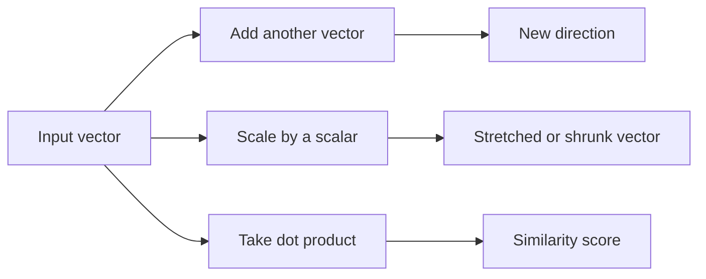

# Mathematics: Part 2 — Vector Operations

## How vectors work in real AI systems

In the first lesson, we saw that a vector can represent a point, a direction, or a collection of features. In this lesson, we focus on the operations that make vectors useful in machine learning.

### 1. Vector addition

Vector addition combines two directions.

```python
import numpy as np

v1 = np.array([2, 1])
v2 = np.array([1, 3])

print(v1 + v2)
```

Geometrically, this is like placing one arrow after another. In data science, adding vectors can represent combining features or accumulating updates.

### 2. Scalar multiplication

Multiplying a vector by a scalar stretches or shrinks it.

```python
import numpy as np

v = np.array([2, 4])
print(3 * v)
print(0.5 * v)
```

If the scalar is negative, the vector flips direction.

This is useful in neural networks because weights often scale input values before combining them.

### 3. Dot product

The dot product measures how aligned two vectors are.

```python
import numpy as np

x = np.array([1, 2, 3])
y = np.array([4, 5, 6])

print(np.dot(x, y))
```

The dot product is closely related to cosine similarity:

$$
\cos(\theta) = \frac{x \cdot y}{\|x\|\|y\|}
$$

This tells us whether two vectors point in similar directions.

### 4. Why dot products matter in AI

The dot product is used everywhere in AI:

- semantic search
- recommendation engines
- attention scores
- neural network layers

A simple neural network layer often uses:

$$
y = w \cdot x + b
$$

Here, the model checks how strongly the input vector matches the learned weight vector.

### 5. Vector norms

A norm measures the size of a vector.

#### L1 norm

The L1 norm is the sum of absolute values.

```python
import numpy as np

v = np.array([3, -4])
print(np.linalg.norm(v, 1))
```

This is often connected with Lasso regularization.

#### L2 norm

The L2 norm is the ordinary Euclidean length.

```python
import numpy as np

v = np.array([3, -4])
print(np.linalg.norm(v, 2))
```

This is the standard length of a vector and is connected with weight decay.

### 6. Why norms matter

Norms are important because they help us control the size of values during training.

They are used for:

- gradient clipping
- regularization
- stability of optimization

### 7. Intuition summary

The essential ideas are:

- vector addition combines directions
- scalar multiplication changes size and direction
- dot products measure similarity
- norms measure magnitude

These operations are the building blocks of almost every machine learning model.

## Diagrams

Here is a simple visual interpretation of the main operations.



The point of these operations is that they transform vectors in controlled and interpretable ways.

## Maths

Vector addition is defined component-wise:

$$
(x + y)_i = x_i + y_i
$$

Scalar multiplication is also defined component-wise:

$$
(\alpha x)_i = \alpha x_i
$$

The dot product is:

$$
x \cdot y = \sum_{i=1}^{n} x_i y_i
$$

The $L_1$ and $L_2$ norms are:

$$
\|x\|_1 = \sum_{i=1}^{n} |x_i|
$$

$$
\|x\|_2 = \sqrt{\sum_{i=1}^{n} x_i^2}
$$

These norms are important because they help us measure the size of vectors and control training behavior in optimization problems.

### Exercise

Try this short exercise:

```python
import numpy as np

x = np.array([1, 2, 3])
y = np.array([2, 0, 4])

print("Dot product:", np.dot(x, y))
print("L2 norm of x:", np.linalg.norm(x))
print("L1 norm of y:", np.linalg.norm(y, 1))
```

Reflect on what each result tells you about the vectors.
