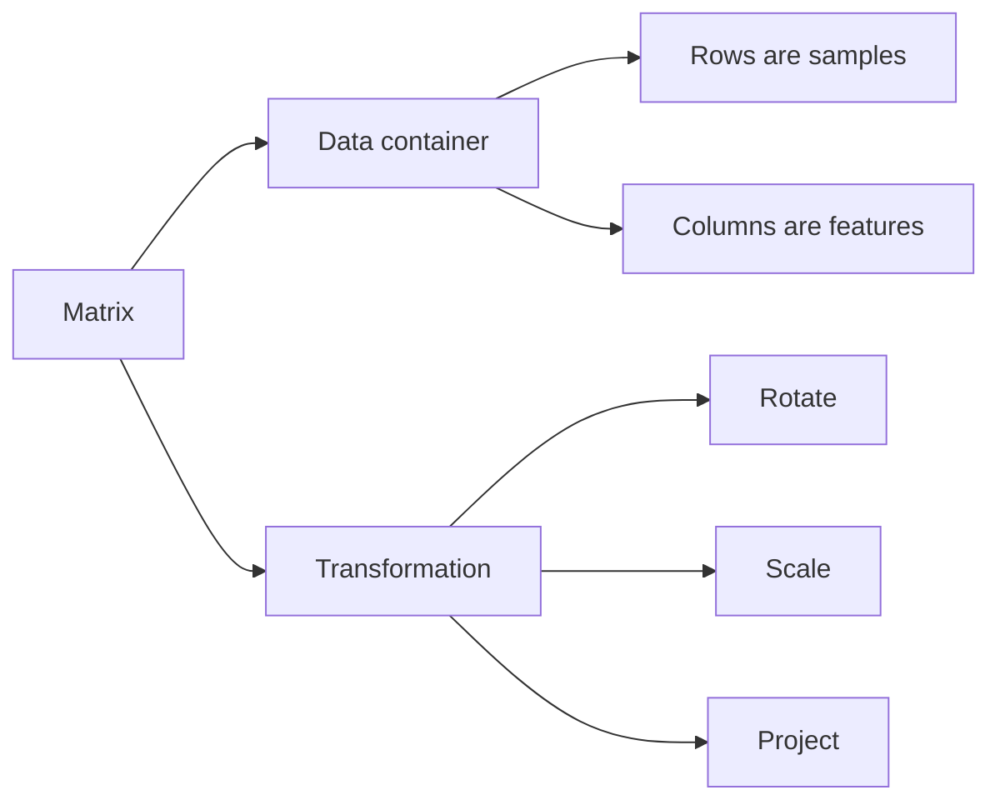

# Mathematics: Part 3 — Matrices as Data and Transformations

## Why matrices are everywhere in AI

Vectors describe one data point. Matrices let us organize many vectors at once, or transform one vector into another.

In machine learning, this gives matrices two jobs:

- as data containers, where rows and columns store examples and features
- as transformations, where multiplication changes the shape, direction, or representation of data

### 1. What is a matrix?

A matrix is a rectangular grid of numbers with rows and columns.

For example:

$$
A =
\begin{bmatrix}
1 & 2 & 3 \\
4 & 5 & 6
\end{bmatrix}
$$

This matrix has 2 rows and 3 columns, so its shape is $2 \times 3$.

In Python, we can represent it with NumPy:

```python
import numpy as np

A = np.array([
    [1, 2, 3],
    [4, 5, 6]
])

print(A)
print(A.shape)
print(A[0, 1])
```

The expression `A[0, 1]` selects the value in row 0 and column 1, which is `2`.

### 2. Matrices as datasets

A dataset is often a matrix:

- each row is one sample
- each column is one feature

For example, suppose we are describing houses with two features: size and number of bedrooms.

```python
import numpy as np

X = np.array([
    [1200, 3],
    [1800, 4],
    [900, 2]
])

print(X.shape)
```

Here, `X` has shape `(3, 2)`: 3 houses and 2 features.

This data-matrix view is central to machine learning because a model usually learns patterns across many rows at once.

### 3. Mini-batches in deep learning

Deep learning models usually do not train on one example at a time. They train on mini-batches.

If each input has 4 features and the batch contains 5 examples, the mini-batch has shape `[batch_size, features]`, or `[5, 4]`.

```python
import numpy as np

batch = np.random.rand(5, 4)

print(batch.shape)
```

Mini-batches make training faster because matrix operations can process many examples in parallel.

### 4. Embedding matrices in transformers

In a transformer, the embedding table is also a matrix.

If a vocabulary has 10,000 tokens and each token embedding has 768 dimensions, the embedding matrix has shape:

$$
10000 \times 768
$$

Each row stores the vector representation of one token.

```python
import numpy as np

vocab_size = 10000
embed_dim = 768

embedding_matrix = np.random.randn(vocab_size, embed_dim)
token_id = 42

token_embedding = embedding_matrix[token_id]

print(token_embedding.shape)
```

Looking up a token means selecting the row that stores its embedding.

### 5. Matrix transpose

The transpose flips rows and columns.

If $A$ has shape $m \times n$, then $A^T$ has shape $n \times m$.

```python
import numpy as np

A = np.array([
    [1, 2, 3],
    [4, 5, 6]
])

print(A.T)
print(A.T.shape)
```

Transposes appear constantly in neural networks, linear regression, and attention because they line up dimensions for multiplication.

### 6. Matrix addition and scalar multiplication

Matrices of the same shape can be added element by element.

```python
import numpy as np

A = np.array([[1, 2], [3, 4]])
B = np.array([[10, 20], [30, 40]])

print(A + B)
print(2 * A)
```

Scalar multiplication stretches every value in the matrix.

### 7. Matrix-vector multiplication

Matrix-vector multiplication is one of the most important operations in machine learning.

```python
import numpy as np

A = np.array([
    [1, 2],
    [3, 4],
    [5, 6]
])

x = np.array([10, 20])

print(A @ x)
```

The shape rule is:

$$
(m \times n)(n) = (m)
$$

The inner dimensions must match. Each row of the matrix takes a dot product with the vector.

This is exactly what a simple neural network layer does:

$$
y = Wx + b
$$

The matrix $W$ learns how to mix input features into output features.

### 8. Matrix-matrix multiplication

Matrix-matrix multiplication lets us transform many vectors at once.

```python
import numpy as np

A = np.array([
    [1, 2, 3],
    [4, 5, 6]
])

B = np.array([
    [1, 2],
    [3, 4],
    [5, 6]
])

print(A @ B)
```

The shape rule is:

$$
(m \times k)(k \times n) = (m \times n)
$$

Matrix multiplication is not commutative. Usually:

$$
AB \ne BA
$$

This matters because changing the order of transformations changes the result.

### 9. Element-wise product

The element-wise product multiplies matching entries. It is also called the Hadamard product.

```python
import numpy as np

A = np.array([[1, 2], [3, 4]])
B = np.array([[10, 20], [30, 40]])

print(A * B)
```

This operation is used in gated neural network architectures such as LSTMs and GRUs, where one vector controls how much of another vector should pass through.

### 10. Broadcasting

Broadcasting lets NumPy automatically stretch smaller arrays across larger arrays when the shapes are compatible.

Bias addition in neural networks often uses broadcasting.

```python
import numpy as np

X = np.array([
    [1, 2, 3],
    [4, 5, 6]
])

b = np.array([10, 20, 30])

print(X + b)
```

The bias vector `b` is added to every row of `X`.

### 11. Special matrices

Some matrices have special structure and meaning.

#### Identity matrix

The identity matrix leaves a vector unchanged.

```python
import numpy as np

I = np.eye(3)
x = np.array([2, 4, 6])

print(I @ x)
```

Formally:

$$
Ix = x
$$

#### Diagonal matrix

A diagonal matrix has nonzero values only on the main diagonal.

```python
import numpy as np

D = np.diag([2, 3, 4])
x = np.array([10, 10, 10])

print(D @ x)
```

It scales each coordinate separately.

#### Symmetric matrix

A symmetric matrix is equal to its transpose:

$$
A = A^T
$$

Covariance matrices are symmetric, which is why they are central to PCA.

#### Orthogonal matrix

An orthogonal matrix satisfies:

$$
Q^TQ = I
$$

Orthogonal matrices preserve lengths and angles. Rotation matrices are a common example.

### 12. Intuition summary

The essential ideas are:

- matrices can store many data points at once
- matrices can transform vectors and batches of vectors
- neural network layers are built from matrix multiplication, bias addition, and nonlinear functions
- special matrix structures explain many model behaviors and algorithms

## Diagrams

The two ways to think about a matrix are closely connected.



This is why the same object can represent a dataset, an embedding table, or a learned neural network layer.

## Maths

For a matrix $A \in \mathbb{R}^{m \times n}$ and a vector $x \in \mathbb{R}^n$, matrix-vector multiplication produces $y \in \mathbb{R}^m$:

$$
y = Ax
$$

Each output component is a dot product:

$$
y_i = \sum_{j=1}^{n} A_{ij}x_j
$$

For matrix-matrix multiplication, if $A \in \mathbb{R}^{m \times k}$ and $B \in \mathbb{R}^{k \times n}$, then:

$$
C = AB, \quad C \in \mathbb{R}^{m \times n}
$$

Each entry is:

$$
C_{ij} = \sum_{r=1}^{k} A_{ir}B_{rj}
$$

In neural networks, a linear layer usually computes:

$$
Y = XW + b
$$

Here, $X$ is a batch of inputs, $W$ is a learned weight matrix, $b$ is a bias vector, and $Y$ is the transformed batch.

### Exercise

Try this short exercise:

```python
import numpy as np
import matplotlib.pyplot as plt

theta = np.deg2rad(45)

rotation = np.array([
    [np.cos(theta), -np.sin(theta)],
    [np.sin(theta), np.cos(theta)]
])

points = np.array([
    [1, 0],
    [0, 1],
    [1, 1],
    [2, 0],
    [0, 2]
])

rotated_points = points @ rotation.T

original_distances = np.linalg.norm(points, axis=1)
rotated_distances = np.linalg.norm(rotated_points, axis=1)

print("Rotation matrix:")
print(rotation)
print("Distances preserved:", np.allclose(original_distances, rotated_distances))

plt.scatter(points[:, 0], points[:, 1], label="Original")
plt.scatter(rotated_points[:, 0], rotated_points[:, 1], label="Rotated")
plt.axis("equal")
plt.legend()
plt.show()
```

Reflect on why rotation changes the position of each point but preserves its distance from the origin.
